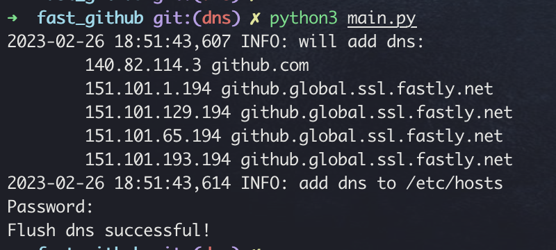

# fast_github
---
If you find that request github.com is too slowly, you can use this script to let your request fast.
This tool is just for MAC

# To start using fast_github
---
- You need have Python3.7(using 3.7 by myself) or higher
- clone code
```shell script
git clone https://github.com/DivineHell/fast_github.git
```
- change directory and install requirement
```shell script
pip3 install -r requirements.txt
``` 
- run this tool
```shell script
python3 main.py
```
---
## Running demo

